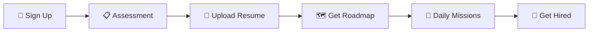

<div align="center">
  
  <br />
  <h1>🚀 GUIDIFY</h1>
  <p>
    <strong>Your career won't plan itself. This does.</strong>
  </p>
  <p>
    AI-powered adaptive career guidance that learns from you, builds your roadmap, and gives you a mission every day until you're job-ready.
  </p>

  <div>
    
    
    
    
    
  </div>
</div>

---

## ✨ Why GUIDIFY?

| Problem | Solution with GUIDIFY |
|---------|------------------------|
| **Generic Advice** | AI profiles your skills, experience, and goals for personalized paths. |
| **Static Roadmaps** | Daily missions that automatically adjust based on your real-time progress. |
| **Resume Guesswork** | AI-powered scoring with actionable, line-by-line improvements. |
| **Interview Anxiety** | Mock interviews with real-time feedback (including non-verbal tracking). |

---

## ⚙️ How It Works



---

## 🌟 Key Features

*   🧠 **Smart Onboarding:** Profile + Career Goals + Psychometric Profiling (Big Five & RIASEC).
*   📄 **Resume Intelligence:** Upload, AI parse, score, and granular gap analysis.
*   🗺️ **Adaptive Roadmaps:** AI-generated, versioned paths that regenerate when you fail or accelerate.
*   🎯 **Daily Missions:** Bite-sized tasks (30-45 min) that iteratively build toward your ultimate goal.
*   🎤 **AI Mock Interviews:** Technical & HR tracks with Delivery Analytics (client-side eye contact, posture, vocal pacing via MediaPipe).
*   📈 **Progress Tracking:** Streaks, skill graphs, phase completion metrics.
*   ⚙️ **Adaptation Engine:** Detects patterns and adjusts your path automatically.

---

## 🛠️ Tech Stack

<details>
<summary><b>Frontend</b></summary>
React 19, TailwindCSS, Vite, MediaPipe
</details>

<details>
<summary><b>Backend</b></summary>
FastAPI, Python 3.11+
</details>

<details>
<summary><b>Database & Auth</b></summary>
Supabase (PostgreSQL), Supabase Auth (Email + OAuth)
</details>

<details>
<summary><b>AI Engine</b></summary>
Google Gemini (2.5 Flash / Lite)
</details>

---

## 🚀 Quick Start

### 1. Clone the Repository
```bash
git clone https://github.com/your-username/guidify.git
cd guidify
```

### 2. Backend Setup
```bash
cd guidify-backend
python -m venv venv
source venv/bin/activate  # On Windows use `venv\Scripts\activate`
pip install -r requirements.txt
```

### 3. Frontend Setup (New Terminal)
```bash
cd guidify-frontend
npm install
npm run dev
```

> **Note:** Don't forget to copy `.env.example` to `.env` in both frontend and backend directories and add your Supabase and Gemini API keys!

---

## 📂 Architecture Overview

```text
guidify/
├── guidify-backend/
│   ├── app/
│   │   ├── api/          # REST endpoints
│   │   ├── ai_gateway/   # Central AI routing (Gemini)
│   │   ├── services/     # Business logic & Rules Engine
│   │   ├── psychometrics/# Psychometric instrument configs
│   │   ├── db/           # Database queries
│   │   └── models/       # Pydantic schemas
│   └── migrations/       # SQL migrations
├── guidify-frontend/
│   └── src/
│       ├── pages/        # Main screens
│       ├── components/   # Reusable UI
│       └── delivery-analytics/ # MediaPipe tracking & Web Audio
└── wiki/                 # Documentation (Public specs)
```

---

<div align="center">
  <sub>Built with ❤️. Adapted by AI. Ready for learners.</sub>
</div>
