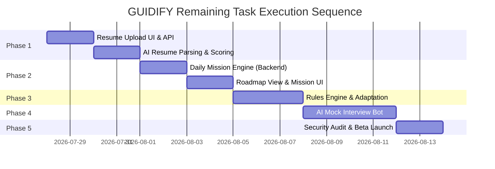

# GUIDIFY — Remaining Tasks & Roadmap Report

**Generated:** Mon Jul 27 2026  
**Status:** Post-Phase 0 Scaffolding & Critical Blocker Fixes  
**Based on:** `docs/prd.md`, `docs/architecture.md`, `docs/schema.md`, `docs/techspec.md`, `docs/logs.md`

---

## Executive Summary & Progress Overview

With the completion of **Phase 0 foundations**, the **central AI Gateway**, the **TailwindCSS design system**, the **Onboarding Career Goals extension**, the **Roadmap Generation API & DB layer**, the **Daily Mission Engine (backend + frontend)**, the **Interactive Roadmap View**, the **Resume Upload UI**, and now the **Resume Parsing & Scoring Backend**, GUIDIFY is currently at **~72% MVP Completion**.

### Completion Breakdown

```
[█████████████████████████████████████████████░░░░░░░░] 72% Total MVP Complete

- Phase 0: Foundations & Architecture     [████████████████████] 100% Complete
- Phase 1: Profile & Resume               [████████████████░░░░]  80% Complete
- Phase 2: Roadmap & Daily Missions       [████████████████████]  90% Complete
- Phase 3: Adaptation Engine              [░░░░░░░░░░░░░░░░░░░░]   0% Complete
- Phase 4: AI Interview Bot               [██░░░░░░░░░░░░░░░░░░]   5% Complete
- Phase 5: Polish & Beta Launch           [░░░░░░░░░░░░░░░░░░░░]   0% Complete
```

---

## Remaining Tasks by Phase

### Phase 1 — Profile & Resume (Remaining: 20%)

The onboarding questionnaire, profile data structures, and **full resume parsing pipeline** are now implemented. The remaining gap is the **Resume Progress & Feedback View** frontend component.

#### 1.1 Frontend Tasks
- [x] **Resume Upload Page (`/resume`)**: ~~Build a modern, Tailwind-styled page allowing learners to upload PDF/DOCX resumes via drag-and-drop.~~ ✅ Session 3
- [ ] **Resume Progress & Feedback View**: Display parsed resume summary, extracted skills, experience level, and actionable resume score/gap analysis.

#### 1.2 Backend & AI Gateway Tasks
- [x] **`POST /api/v1/resume/upload` endpoint**: ~~Implement multipart file processing (PDF/DOCX extraction via PyPDF/pdfplumber), store file in Supabase Storage, and trigger AI analysis.~~ ✅ Session 4
- [x] **`resume.parse` AI Gateway Task**: ~~Create prompt template `app/ai_gateway/prompts/resume_parse.py` to extract structured JSON (contact info, work experience, education, technical skills, soft skills).~~ ✅ Session 4
- [x] **`resume.score` AI Gateway Task**: ~~Create prompt template `app/ai_gateway/prompts/resume_score.py` to generate resume strength score (0-100), key gap analysis against stated target role, and top 3 improvements.~~ ✅ Session 4
- [x] **Profile Assembly Integration**: ~~Automatically merge parsed resume skills and experience into `learner_profiles` table (`resume_data` & `skills` columns).~~ ✅ Session 4
- [ ] **Supabase Storage bucket (`resumes`)**: Configure storage bucket with learner-isolated RLS policies (`auth.uid()`).

---

### Phase 2 — Roadmap & Daily Missions (Remaining: 50%)

Roadmap backend generation (`POST /api/v1/roadmap/regenerate`) and database versioning (`002_roadmaps.sql`) are fully implemented. The remaining tasks center on the **Frontend Roadmap View** and the **Daily Mission Engine**.

#### 2.1 Daily Mission Engine (Backend)
- [x] **`GET /api/v1/missions/today` Endpoint**: ~~Implement daily mission retrieval and auto-generation logic.~~ ✅ Session 3
- [x] **`mission.generate` AI Gateway Task**: ~~Create prompt template `app/ai_gateway/prompts/mission_generate.py` using `gemini-2.5-flash-lite`.~~ ✅ Session 3
- [x] **`POST /api/v1/missions/{id}/complete` Endpoint**: ~~Handle mission completion, log activity, increment streak.~~ ✅ Session 3
- [x] **`POST /api/v1/missions/{id}/status` Endpoint**: ~~Handle status updates (`failed`, `skipped`, `in_progress`).~~ ✅ Session 3
- [x] **Missions Table Migration (`003_missions.sql`)**: ~~Create `daily_missions` table schema.~~ ✅ Session 3 (needs to be run on Supabase)

#### 2.2 Frontend Components
- [x] **Interactive Roadmap View (`/roadmap`)**: ~~Build full-screen roadmap visualization showing phases, skills, difficulty tags, and current active phase highlighting.~~ ✅ Session 3 — Complete TailwindCSS rewrite with expandable phases, milestones, progress bar, regenerate action.
- [x] **Daily Mission Modal / Card**: ~~Add "Start Mission" action flow on Dashboard with objective breakdown, resource links, and "Mark as Complete" button.~~ ✅ Session 3 — `MissionCard.jsx` component with Start/Complete/Skip actions, step expansion, resource links.

---

### Phase 3 — Adaptation Engine (Remaining: 100%)

The Adaptation Engine evaluates mission performance over time and automatically recalculates or adjusts the roadmap.

#### 3.1 Rules Engine (`app/services/rules_engine.py`)
- [ ] **Debounce Window Enforcer**: Enforce 24-hour minimum window between automatic roadmaps regenerations (rules.md §1.3).
- [ ] **Failure Pattern Detector**: Trigger adaptation when 3 consecutive missions are marked `failed` or `too_hard`.
- [ ] **Goal Change Trigger**: Automatically queue immediate full roadmap regeneration when `target_role` is updated via `PATCH /profile/target-role`.
- [ ] **Skill Gap Analysis Service**: Calculate real-time gap delta between learner's current skills and required target role skills.

#### 3.2 Adaptation UI & Dashboard Integration
- [ ] **Adaptation Alert Banner**: Notify learner when their roadmap has adapted due to performance or goal changes.
- [ ] **Skill Graph Component**: Render visual skill mastery graph vs target role expectations on the dashboard.

---

### Phase 4 — AI Mock Interview Bot (Remaining: 100%)

Interactive conversational AI agent conducting technical and HR practice interviews with detailed feedback reports.

#### 4.1 AI Gateway Tasks
- [ ] **`interview.question` Task**: Create prompt template `app/ai_gateway/prompts/interview_question.py` using `gemini-2.5-flash-lite` to generate adaptive follow-up interview questions based on target role & previous answers.
- [ ] **`interview.feedback` Task**: Create prompt template `app/ai_gateway/prompts/interview_feedback.py` using `gemini-2.5-flash` to evaluate response technical accuracy, communication clarity, and structure (STAR method).

#### 4.2 Backend & DB
- [ ] **Interview Sessions Table (`004_interviews.sql`)**: Create schema for `interview_sessions` and `interview_messages`.
- [ ] **`POST /api/v1/interview/session`**: Initialize session for technical or HR track based on current roadmap phase.
- [ ] **`POST /api/v1/interview/session/{id}/answer`**: Submit audio transcript/text answer, generate AI feedback and next question.
- [ ] **`GET /api/v1/interview/session/{id}`**: Fetch full session transcript and overall performance score.

#### 4.3 Frontend UI
- [ ] **Interview Bot Room (`/interview`)**: Interactive chat/voice interface with question prompt, speech-to-text input option, timer, and live response submission.
- [ ] **Interview Evaluation Report Card**: End-of-session summary showing Technical Readiness %, Communication score, strengths, and areas for improvement.

---

### Phase 5 — Polish, Security & Beta Launch (Remaining: 100%)

Final hardening and preparation for production deployment.

#### 5.1 Security & Compliance
- [ ] **DPDP Consent Enforcement**: Enforce data processing and AI training consent toggles during onboarding.
- [ ] **RLS Policy Audit**: Verify row-level security on all tables (`learners`, `learner_profiles`, `roadmaps`, `daily_missions`, `interview_sessions`).
- [ ] **Signed URLs**: Use Supabase signed URLs for secure resume document access.

#### 5.2 Cleanup & Refactoring
- [ ] **Legacy Route Removal**: Delete 14 orphaned route files in `guidify-backend/app/routes/` and legacy service files superseded by `/api/v1/` and `ai_gateway`.
- [ ] **Comprehensive Error Boundaries**: Ensure all API errors render clean toast/banner alerts instead of unhandled exceptions.

---

## Recommended Execution Order



| Order | Task | Module | Key Target File(s) | Status |
|---|---|---|---|---|
| **1** | ~~Build Daily Mission Engine~~ | Backend & DB | `migrations/003_missions.sql`, `app/api/missions.py`, `app/ai_gateway/prompts/mission_generate.py` | ✅ Session 3 |
| **2** | ~~Daily Mission UI on Dashboard~~ | Frontend | `src/pages/Dashboard.jsx`, `src/components/dashboard/MissionCard.jsx` | ✅ Session 3 |
| **3** | ~~Resume Upload & AI Parsing~~ | Backend & Frontend | `app/api/resume.py`, `app/ai_gateway/prompts/resume_parse.py`, `src/pages/ResumePage.jsx` | ✅ Session 4 |
| **4** | ~~Roadmap Phase Details View Page~~ | Frontend | `src/pages/CareerRoadmap.jsx` | ✅ Session 3 |
| **5** | Adaptation Engine (Rules) | Backend | `app/services/rules_engine.py` | ⬜ Not started |
| **6** | AI Interview Bot | Backend & Frontend | `app/api/interview.py`, `src/pages/InterviewPage.jsx` | 🔶 Placeholder UI done |
| **7** | Legacy Code Cleanup | Repo-wide | Remove `guidify-backend/app/routes/*.py` | ⬜ Not started |
